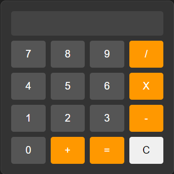

# Complete calculator code in HTML, CSS and JavaScript.
This project marks the beginning of continuous JS studies.
With a calculator programmed in JS I am marking the beginning of several projects in this language.

## Calculator

